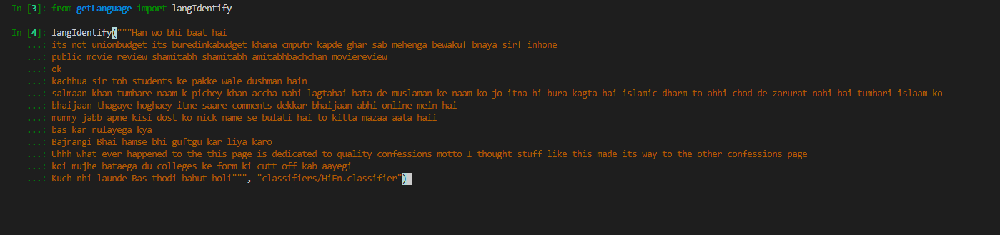
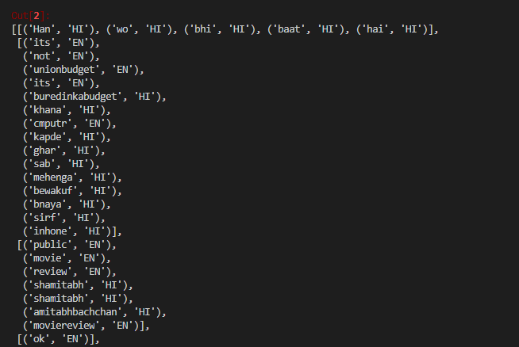

# Language Identification (LID) for Code-Mixed text
---

This is a word level language identification tool for identifying Code-Mixed text of languages (like Hindi etc.) written in roman script and mixed with English. At a broader level, we utilize a ML classifier that's trained using MALLET to generate word level probabilities for language tags. We then utilize these probabilities along with the context information of surrounding words to generate language tags for each word of the input. We also use hand-crafted dictionaries as look-up tables to cover unique, corner and conflicting cases to give a robust language identification tool. 

**Note:** 

- Please read the [Papers](#Papers) section to understand the theory and experiments surrounding this project. 

- The trained ML classifier model and dictionaries that are shipped by default with this project are specifically for `Hindi-English` Code-Mixed text.

- You can use this project to extend it to `any language pairs`. More information in [Train your Custom LID](#train-your-custom-lid).


# Project Structure
---
The project has the following structure: 
```
LID-tool/
├── README.md
├── classifiers/
├── config.ini
├── dictionaries/
├── getLanguage.py
├── sampleinp.txt
├── sampleinp.txt_tagged
├── sampleoutp.txt
├── tests/
├── tmp/
└── utils/
```

Here is more info about each component:
 - **classifiers/** - contains classifiers that are trained using MALLET. For now, we have a single classifier "HiEn.classifier".
 - **config.ini** - config file for the project. You can learn more about the config file in the [Working with the Config file to create dictionary and control other aspects of the project](Train_Custom_LID.md#working-with-the-config-file-to-create-dictionary-and-control-other-aspects-of-the-project).
 - **dictionaries/** - contains various Hindi and English dictionaries used in the project.
 - **getLanguage.py** - main file of the project, contains code for classifying input text into language tags.
 - **sample\* files** - contain the sample input, tagged and outputs of the LID.
 - **tests/** - contains validation sample sets from FIRE shared tasks, good for validating performance of the LID.
 - **tmp/** - temporary folder for holding intermediate MALLET files.
 - **utils/** - contains utility code for the LID like extracting features etc.

# Papers

- [Query word labeling and Back Transliteration for Indian
Languages: Shared task system description - Spandana Gella et. al](https://www.isical.ac.in/~fire/wn/STTS/2013_translit_search-gella-msri.pdf)
- [Testing the Limits of Word level Language Identification](https://www.aclweb.org/anthology/W14-5151.pdf)

# Installation
---
The installation of the tool is pretty straightforward as most of it is plug-n-play. Once you get all the required depencies you are good to go.

Once you clone the repository in your local system you have the code, and you can start installing the dependencies one by one.

## Dependencies
 1. **Java** - This project uses MALLET (written in java) to train/run classifiers hence you'd need java in your system. You can get a JRE from here:

 ```
 https://www.oracle.com/java/technologies/javase-jre8-downloads.html
 ```
 2. **Python 3** - This project is written in Python 3 hence make sure to have it before running the LID. You can get Python 3 from Miniconda:

 ```
 https://docs.conda.io/en/latest/miniconda.html
 ```

 3. **MALLET** - You can download mallet binaries from the [mallet download page](http://mallet.cs.umass.edu/download.php) and follow the installation instructions given there.


 4. **Twitter Text Python (TTP)** - You can simply install it using pip:

 ```
pip install twitter-text-python
 ```

## Setup

**1. Linux Installation:**
The major setup step required is to give executable rights to mallet binary. You can do so by the following command:

```
chmod +x mallet-2.0.8/bin/mallet
```

**2. Windows Installation:**
The major setup step in windows is to make sure that you have set the correct environment variables for Python and Java. If you want to test whether the environment variables are rightly set or not, check whether they are accessible from the command prompt.

You also have to make sure that you have set the environment variable `MALLET_HOME` to the LID project's mallet folder. You can do so by opening a command prompt and typing:
```
set MALLET_HOME=\path to your LID directory\mallet-2.0.8\
```
Once you are done with the above set of steps, the next step is to just start using the LID.

# Usage
---

## I. Getting Inference on a text input


## a. Using LID in File Mode

You can simply execute getLanguage.py with the input file containing text data to be classified.

**Usage:**	

```
python getLanguage.py <input_file>
```

**Example:**		
```
python getLanguage.py sampleinp.txt
```
Output is written to `sampleinp.txt_tagged` or <input_file_tagged>

**Things to Note:**	

1. Input file should contain lines in the following format:
```
<sentenceId>TAB<sentence>
```
**Example:**
```
 1	Yeh mera pehla sentence hai
```
See sampleinp.txt for an example.

2. Make sure that there is no empty line or line with no text in the input file as the LID might throw an error.

## b. Using LID in Library Mode
You can also use this LID as a library that can be imported in your own program and code.

Simply write the following lines of code:

```python
from getLanguage import langIdentify

# inputText is a list of input sentences
# classifier is the name of the mallet classifier to be used
langIdentify(inputText, classifier)
```
The input will be a list of sentences to be language tagged, like this:



The output will be a list of language tagged input sentences in such a way that each (word, tag) is a tuple pair:



## II. Training your own MALLET classifier

Currently the project ships with classifier for Hindi-English pair by default but you can also train a classifier for your own language pairs.

Refer to the research papers attached to understand the methodology and the training paremeters.

You can use MALLET documentation on how to use it's API for training a new classifier: http://mallet.cs.umass.edu/classification.php

More information in [Train your Custom LID](#train-your-custom-lid).

## III. Testing a new classifier 

We have collated a set of data sets that can be used as a validation set in case you want to test a new version of the classifier or any changes in the LID itself. Currently, they are only for Code-Mixed Hindi-English pair:

1. tests/Adversarial_FIRE_2015_Sentiment_Analysis_25.txt - 25 hardest input sentences from [FIRE 2015 Sentiment Analysis task](http://amitavadas.com/SAIL/data.html).
2. tests/FIRE_2015_Sentiment_Analysis_25.txt - first 25 sentences from the FIRE 2015 Sentiment Analysis task.
3. tests/test_sample_20.txt - 20 manually written code-mixed sentences.

You can use a test set by simply giving it as a parameter to getLanguage:

```
python getLanguage.py tests/<test_name>
```

For example:

```
python getLanguage.py tests/test_sample_20.txt
```

The above command will execute your updated/new LID code on 20 manually crafted code-mixed sentences.

**Larger Datasets**

If you want to test your LID on larger datasets, then you can look at these two FIRE tasks:
1. [FIRE 2013 LID task](https://cse.iitkgp.ac.in/resgrp/cnerg/qa/fire13translit/fire_data.html) -  The original dataset of 500 sentences for which this LID was built.
2. [FIRE 2015 Sentiment Analysis task](http://amitavadas.com/SAIL/data.html) - 12,000+ language tagged sentences.

# Train your Custom LID
---

There are a couple of changes and prelminary steps you need to train your own custom LID. You can follow the documentation page on [Train your Custom LID](Train_Custom_LID.md) for more information.

# Attribution
---
These are the open-source projects that this LID uses:

1. [MALLET: A Machine Learning for Language Toolkit. McCallum, Andrew Kachites.](http://mallet.cs.umass.edu/about.php)
2. [Twitter-Text-Python (TTP) by Edmond Burnett](https://github.com/edmondburnett/twitter-text-python)

Apart from the above set of projects, we also use free and openly hosted dictionaries in the project to improve the LID, you can learn more about them in [Train your Custom LID](Train_Custom_LID.md).

# Contributors
---

In the order of recency, most recent first :-

 - [Mohd Sanad Zaki Rizvi](https://github.com/mohdsanadzakirizvi) 
 - Anirudh Srinivasan 
 - Sebastin Santy
 - Anshul Bawa
 - Silvana Hartmann
 - Royal Sequeira
 - Gokul Chittaranjan 
 - Jatin Sharma
 - Spandana Gella


# Contributing to this Code
---

This project welcomes contributions and suggestions.  Most contributions require you to agree to a
Contributor License Agreement (CLA) declaring that you have the right to, and actually do, grant us
the rights to use your contribution. For details, visit https://cla.opensource.microsoft.com.

When you submit a pull request, a CLA bot will automatically determine whether you need to provide
a CLA and decorate the PR appropriately (e.g., status check, comment). Simply follow the instructions
provided by the bot. You will only need to do this once across all repos using our CLA.

This project has adopted the [Microsoft Open Source Code of Conduct](https://opensource.microsoft.com/codeofconduct/).
For more information see the [Code of Conduct FAQ](https://opensource.microsoft.com/codeofconduct/faq/) or
contact [opencode@microsoft.com](mailto:opencode@microsoft.com) with any additional questions or comments.
