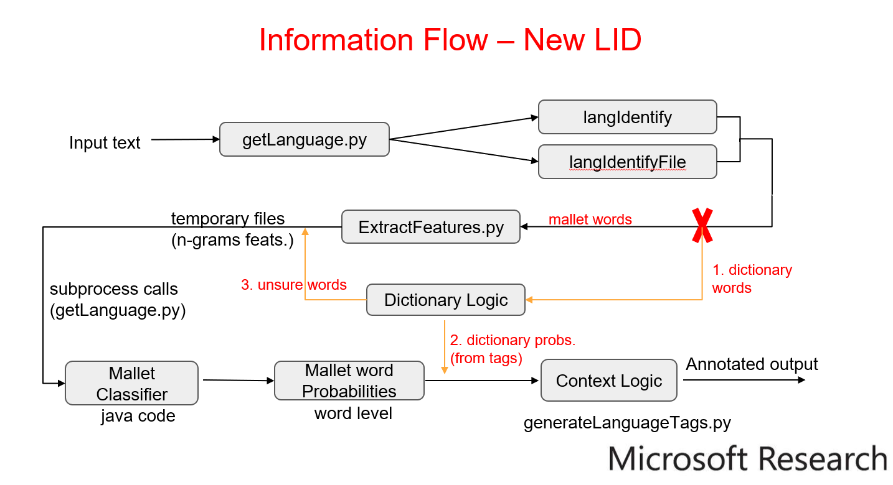
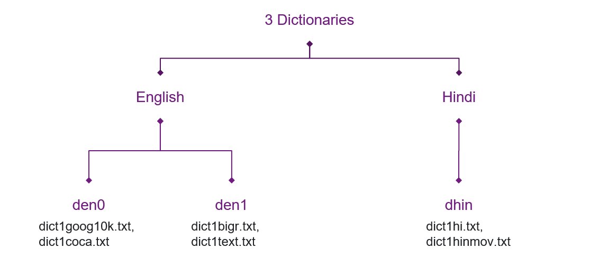

# Information Flow of LID

The following is a very high level approximation of how information flows in the LID:

Let's understand what is happening here:

 - Whenever you provide input to `getLanguage.py`, one of the `langIdentify()` or `langIdentifyFile()` functions are triggered based on whether you are using the LID in file mode or library mode.
 - Either of these functions, take your input sentences and split them into words. Then, on each sentence we invoke `callMallet()`. This function essentially has 2 tasks.
 - 1st task is to check which words are already present in language dictionaries that we have, we can directly assign language tags to such words using our logic. 
 - The words that aren't present in the dictionaries are split away and sent to ML classifier that's trained using MALLET.
 - 2nd task is to call ML classifier on such words, but before that we invoke `ExtractFeatures.py` to generate `n-gram` features for the ML model. Once features are generated and ML classifier is called, it gives out certain probabilities for each word for both the languages.
 - Sometimes a set of words that are present in the dictionary are not tagged due to some corner cases (we have discussed in the next section). In such case, we `re-invoke ML classifier` on these words to get language probabilities.
 - Finally, we combine the probability values of both set of words: one that were processed by the ML classifier and the other ones which were tagged using dictionaries (We use custom probability values of `1E-9` and `0.999999999` for wrong and right language tags respectively for each dictionary tagged word; you can change these values using the `config` file).
- Now that the input words are combined once again, their probability values are fed into the context based tagging logic (explained in the research paper). This algorithm, gives out the final language tags.

This was a quick walkthrough the code, you can read the research papers for more information around the algorithm:

- [Query word labeling and Back Transliteration for Indian
Languages: Shared task system description - Spandana Gella et. al](https://www.isical.ac.in/~fire/wn/STTS/2013_translit_search-gella-msri.pdf)
- [Testing the Limits of Word level Language Identification](https://www.aclweb.org/anthology/W14-5151.pdf)

# About Dictionaries and How to create your own?

## I. Brief description of each dictionary currently used in the project:

The project currently uses 4 manually crafted dictionaries for English and 2 for Hindi words. Here is how they have been sourced: 

1.	dictionaries/dict1bigr.txt – Uses a sample of 2-grams English words from [Google's Ngram viewer]().
2.	dictionaries/dict1coca.txt – Uses a sample of English words from [Corpus of Contemporary American English]().
3.	dictionaries/dict1goog10k.txt – Uses a sample of 10000 most frequent words from [Google's Trillion Word Corpus]().
4.	dictionaries/dict1hi.txt – Semi-automatically selected set of common Hindi words in the roman script.
5.	dictionaries/dict1hinmov.txt – Same as 4 but has common Hindi words prevalent in movie scripts.
6.	dictionaries/dict1text.txt – Manually curated list of slang and commonly used internet short-hands of English.

The above set of dictionaries are combined in different combinations to form language dictionaries for Hindi and English. Here is an overview:

You can choose which files are used to combine in what permutation for each dictionary using the `[DICTIONARY HIERARCHY]` section of the `config.ini` file. Check [Working with the Config file to create dictionary and control other aspects of the project](#working-with-the-config-file-to-create-dictionary-and-control-other-aspects-of-the-project) for more info.

## II. Reason for using Dictionaries and How to create your own custom dictionaries for a new use-case or language pairs?

The addition of dictionaries in the project was an engineering decision that was taken after considering the empirical results, which showed that the dictionaries complemented the performance of the ML-based classifier (MALLET) for certain corner-cases. 

Here are some of the problems that this method solved:
### 1. Dealing with “common words” that can belong to either of the languages. 

For example, the English word `“to”` is one of the ways in which the Hindi word `“तो”` or `“तू”` is spelt when written in `roman script` so the word “to” will be classified differently in the following two sentences:

**Input:**       I have to get back to my advisor

**Output:**    I/EN have/EN ***to/EN*** get/EN back/EN to/EN my/EN advisor/EN 

**Input:**       Bhai to kabhi nahi sudhrega

**Output:**    Bhai/HI ***to/HI*** kabhi/HI nahi/HI sudhrega/HI

In this case, we make sure that the word “to” is present in both the dictionaries and the LID is supposed to focus more on the combination of ML probabilities and Context (surrounding words) to tag the language. 

### 2. Words that surely belong to only one language. 

For example, words like “bhai”, “nahi”, “kabhi” in Hindi and words like “advisor”, “get” etc. in English. In this case, we utilize the relevant dictionary to force tag it to the correct language even if the ML classifier says otherwise.

So the questions that you have to ask yourself while creating the dictionaries are: 

1. “Are there certain words that can be spelt the same way in both the languages?” And, 
2. “Are there common words in one language that surely can’t be used in the other language?”

These are just a couple of things that we looked at while building this tool, but given your specific use-case you can consider more such engineering use-cases and customize the dictionaries accordingly.

# Working with the Config file to create dictionary and control other aspects of the project

The [config.ini](config.ini) file is like the central command center of the project. The fields are self explanatory and rightly commented so that you have an idea of what each field does. 

All the information required to run the project is picked from this file.

Some of the important things for which you can use config file are:

1. You can give path to the different folders of the project like where is the data folder that contains all the dictionaries or where in your system Mallet's binaries are present.

2. You can also give names of the language pairs for which you are training your LID, the information from here used everywhere internally in the project.

3. You can also specify the names of the dictionaries for each language, and how are different files combined in what order to create each dictionary. See the existing `config.ini` file for an example.

4. Finally, you can provide the custom probability values to be used for dictionary tagged words in the project.

# Specific areas in code that need to be changed when creating your own LID

Here are a couple of changes that you'd need to do in case you are creating a new LID for different language pairs

1. First of all, use the `config.ini` file to override the default values for language names, the structure and names of dictionaries etc.
2. You will have to re-write the custom logic of `dictTagging()` function in order to utilize your new dictionaries. Have a look at our logic to understand how using a simple set of conditionals, we choose which language tagged is to be alloted.